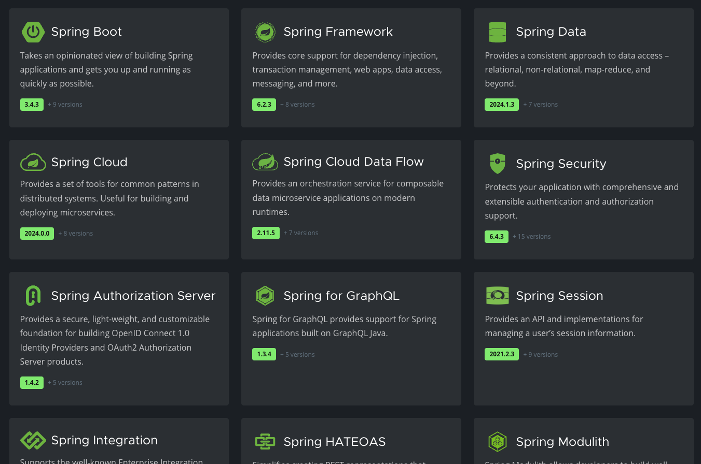

스프링부트가 생겨난 과정을 이해하려면 먼저 스프링 프레임워크의 배경에 대해 알아야 한다.

스프링 프레임워크는 2003년에 처음 출시된 자바 기반의 경량 프레임워크로, 그 당시 무겁고 복잡했던 EJB(Enterprise JavaBeans)에 비해 훨씬 가볍고 유연한 대안을 제공했다. 로드 존슨(Rod Johnson)이 2002년에 쓴 책 "Expert One-on-One J2EE Design and Development"에서 나온 아이디어를 바탕으로 만들어졌다. 스프링은 의존성 주입(DI), 제어의 역전(IoC), 그리고 AOP(Aspect-Oriented Programming) 같은 기능을 통해 개발자들에게 모듈화되고 테스트하기 쉬운 환경을 제공했다.

## 스프링 프레임워크의 한계

https://spring.io/projects 현재 스프링에서 진행되고 있는 프로젝트만 하더라도 무려 25개다!!

시간이 지나면서 스프링은 점점 더 많은 기능을 추가했고, 그만큼 설정도 복잡해졌다. 특히 XML기반의 설정 파일이 길어지고 복잡해지면서, 개발자들을 애플리케이션을 시작하는데 많은 시간을 써야했다. 구체적으로는 다음과 같은문제점이 있었다.

1. XML 기반 설정 문제

- 초기 Spring은 대부분 XML을 사용하여 Bean을 등록해야 했다.
- 설정 파일이 너무 많아지고, 유지보수가 어려워졌다.

2. 복잡한 환경 설정

- 데이터베이스 연결, 트랜잭션 관리, 보안, 메시징 등 많은 설정을 수동으로 해야 했다.
3. 배포의 어려움
- 기존 Java EE 환경에서는 웹 애플리케이션을 실행하려면 WAR 파일을 만들어 WAS (Web Application Server)에 배포해야 했다.

4. 개발 속도 저하

- 설정과 배포 과정이 복잡해지면서 개발 속도가 느려졌다.

## Spring Boot의 등장

Spring Boot는 **Pivotal**에서 2014년 발표한 프로젝트로, 위의 문제를 해결하기 위해 `Spring을 쉽게 사용하자`는 목표로 만들어졌다. 스프링부트는 "Convention over Configuration(설정보다 관습)"이라는 철학을 바탕으로 만들어졌는데, 이는 개발자가 일일이 설정하지 않아도 일반적인 경우에 맞는 기본 설정을 자동으로 제공한다.

### **Spring Boot가 제공했던 혁신**

1. **설정 최소화**
    - XML 설정을 제거하고, `@Configuration`, `@ComponentScan`, `@Bean` 등의 어노테이션을 활용한 설정 방식을 도입했다.
    - `application.properties` 또는 `application.yml` 파일을 통해 간단한 설정만 하면 됨.
2. **자동 설정 (Spring Boot Auto Configuration)**
    - Spring Boot는 내부적으로 **의존성(Dependencies)에 맞춰 자동으로 필요한 Bean을 설정한다**.
    - 예를 들어, `spring-boot-starter-web`을 추가하면 자동으로 **Tomcat, MVC 설정**이 적용됨.
3. **독립 실행 가능 애플리케이션 (Standalone Application)**
    - 내장 웹 서버 (Embedded Tomcat, Jetty, Undertow)를 지원하여, **별도의 WAS 없이 실행 가능**.
    - `java -jar myapp.jar` 명령어 하나로 바로 실행 가능.
4. **Spring 프로젝트 라이브러리 의존성 간소화**
    - `spring-boot-starter-*`를 이용하여 관련 묶어서 제공하여 버전 관리를 편리하게 할 수 있도록 함.